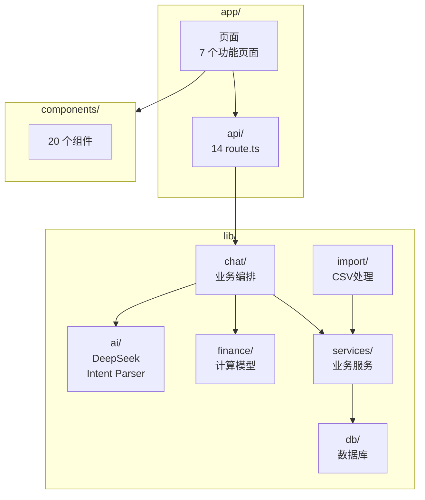
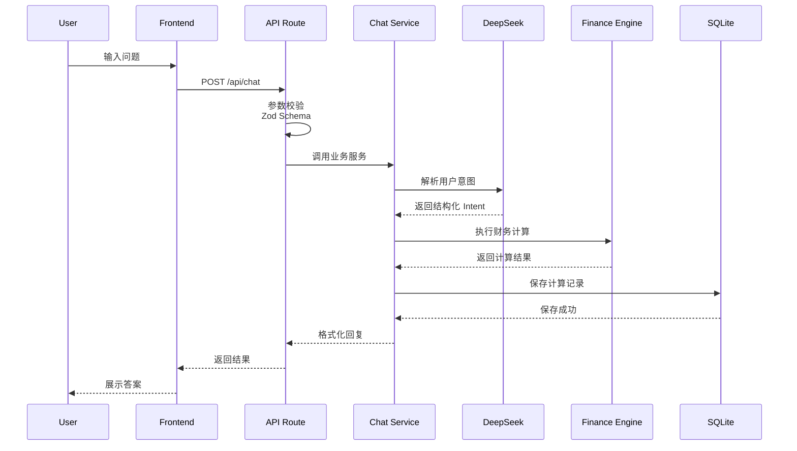

# AI 个人财务 CFO 项目理解

> 整理日期：2026-08-01
> 项目路径：`ai-finance-cfo/`

## 项目定位与核心原则

**AI 个人财务 CFO**：本地优先的个人财务学习项目，对应课程第 28-34 课，当前处于 MVP 验收阶段。

核心设计原则：

> AI 只负责理解问题，不直接计算财务金额；所有金额由确定性 TypeScript + Decimal.js 计算，并可追溯。

- 财务结果由确定性函数计算，同一输入必有同一输出。
- 网络响应和模型输出都经过 Zod 校验（信任边界）。
- 金额计算使用 Decimal.js，避免浮点误差。
- 关键计算保存输入、公式版本、步骤和输出，可追溯。
- 财务数据默认保存在本地 SQLite 数据库。

## 架构总览




信任边界：**UI / 模型输出 → Zod 契约层校验 → 业务编排 → 确定性纯函数计算 → 落库**。金额从不直接来自模型输出。

## 两条核心数据流

**Chat 闭环**（当前只有 `savings_goal` 意图完成完整闭环）：

```txt
用户问题 → POST /api/chat
→ DeepSeek 意图解析 → Zod 校验为受限 FinanceIntent（只有目标金额/期限，不含计算结果）
→ executeChatService：
    buildSavingsGoalContext（读流水+账户，构造计算输入）
    → calculateSavingsGoal（确定性计算 projectedAmount/gap 等）
    → 保存 calculation_history（input/formula/output/model_trace 全 JSON 可追溯）
    → formatSavingsGoalReply（生成自然语言回复）
→ 前端展示回复、假设、计算步骤
```




**CSV 导入**：

```txt
浏览器 Papa Parse + 字段映射 → 服务端预览（清洗/分类/疑似查重）
→ 用户确认 → 批量写入 transactions → 仪表盘与 Chat 读取
```


## 分层与逐文件说明


### 1. 表现层


#### `app/` 页面（7 个功能页 + 根布局）


| 文件                   | 作用                                                                                          |
| -------------------- | ------------------------------------------------------------------------------------------- |
| `layout.tsx`         | 根布局：全局导航（7 个入口）、`lang="zh-CN"`、全局样式引入                                                       |
| `page.tsx`           | 首页：从 `mock-data.ts` 的 `featureCards` 渲染功能卡片导航                                               |
| `chat/page.tsx`      | AI 对话页：维护消息状态机（idle/submitting/error）、提交锁防重复、调用 `/api/chat` 并用 `chatApiResponseSchema` 校验响应 |
| `dashboard/page.tsx` | 仪表盘页：默认当前月基准、`/api/dashboard` 拉取指标/趋势/分类、账户管理（表单+列表+增删改）                                    |
| `goals/page.tsx`     | 储蓄目标页：手动输入参数直接调 `calculateSavingsGoal`（不经 AI），展示结果和步骤                                       |
| `scenarios/page.tsx` | What-if 场景页：基线+变更输入，调用 `/api/scenarios`，展示目标时间影响文案                                          |
| `import/page.tsx`    | CSV 导入页：浏览器端 Papa 解析 + 字段映射猜测 + 行清洗，分步走 preview → confirm                                   |
| `history/page.tsx`   | 计算历史页：`parseCalculationHistory` 安全解析每行历史，坏记录单条隔离                                            |
| `globals.css`        | Tailwind 全局样式                                                                               |


#### `components/` 组件（按域拆分，全部受控组件，无业务逻辑）


| 文件                                   | 作用                                            |
| ------------------------------------ | --------------------------------------------- |
| `accounts/AccountCard.tsx`           | 单个账户展示卡片（类型标签/余额着色）                           |
| `accounts/AccountForm.tsx`           | 账户新增/编辑表单（受控，含错误展示）                           |
| `accounts/AccountList.tsx`           | 账户列表容器，空时回退 `EmptyAccounts`                   |
| `accounts/EmptyAccounts.tsx`         | 空状态提示                                         |
| `accounts/ErrorMessage.tsx`          | 通用错误提示条                                       |
| `chat/ChatComposer.tsx`              | 对话输入框：Enter 提交、提交中禁用                          |
| `chat/ChatMessageList.tsx`           | 消息列表渲染（user/assistant 区分，自动滚动）                |
| `chat/ChatCalculationCard.tsx`       | 结构化计算结果卡片：金额、假设、复用 `CalculationSteps`         |
| `dashboard/MetricCard.tsx`           | 单个指标卡片                                        |
| `dashboard/DashboardMetrics.tsx`     | 8 项核心指标卡片组（净资产/资产/负债/收支/结余/储蓄率/负债率）           |
| `dashboard/CashFlowSummary.tsx`      | 本月现金流汇总（含无数据空态）                               |
| `dashboard/CashFlowTrendChart.tsx`   | Recharts 折线图：收入/支出/结余趋势                       |
| `dashboard/CategoryExpenseChart.tsx` | Recharts 柱状图：分类支出                             |
| `dashboard/chart-formatters.ts`      | 图表专用格式化（轴用"万"紧凑格式、tooltip 完整格式）               |
| `dashboard/DashboardEmptyState.tsx`  | 仪表盘空数据引导                                      |
| `goals/CalculationSteps.tsx`         | 计算步骤展示（步骤序号/公式/输入/输出），被 goals、chat、history 复用 |
| `import/CsvFilePicker.tsx`           | 选择账户 + 上传文件                                   |
| `import/CsvFieldMappingForm.tsx`     | 字段映射表单（可改猜测结果）                                |
| `import/CsvPreviewTable.tsx`         | 预览表：合法/错误/疑似重复行区分、分类可改、行勾选                    |
| `import/CsvImportSummary.tsx`        | 导入结果汇总（成功/跳过）                                 |


### 2. API 路由层 `app/api/`（薄路由：校验 → 编排/计算 → 统一响应）


| 文件                                   | 作用                                                                     |
| ------------------------------------ | ---------------------------------------------------------------------- |
| `health/route.ts`                    | 健康检查，返回服务状态                                                            |
| `accounts/route.ts`                  | GET 列表 / POST 创建（`createAccountSchema` 校验）                             |
| `accounts/[id]/route.ts`             | PATCH 更新 / DELETE 软删除                                                  |
| `transactions/route.ts`              | GET 列表 / POST 创建流水                                                     |
| `liabilities/route.ts`               | GET 列表 / POST 创建负债                                                     |
| `cash-flow/route.ts`                 | GET 按月现金流（`?month=YYYY-MM`，校验格式）                                       |
| `dashboard/route.ts`                 | GET 仪表盘（`?month` + `?months=3|6|12`，并行读三类数据 → `calculateDashboard`）    |
| `calculations/savings-goal/route.ts` | POST 储蓄目标计算（手动路径：校验 → 计算 → 存历史）                                        |
| `calculations/history/route.ts`      | GET 最近 20 条计算历史                                                        |
| `scenarios/route.ts`                 | GET 列表 / POST What-if 计算并存场景                                           |
| `imports/csv/preview/route.ts`       | POST 预览：查重（文件内 + 数据库）后返回带 `duplicate` 标记的行和汇总                          |
| `imports/csv/confirm/route.ts`       | POST 确认：重新查重，跳过重复行，批量写入流水                                              |
| `chat/route.ts`                      | POST 对话闭环：意图解析 → `executeChatService`，错误码 → HTTP 状态映射（422/400/500/502） |


配套 `lib/api/response.ts`：统一 `{ ok: true, data }` / `{ ok: false, error: { code, message } }` 信封。

### 3. 业务编排层 `lib/chat/`（Chat 闭环的编排与错误治理）


| 文件                              | 作用                                                                                                        |
| ------------------------------- | --------------------------------------------------------------------------------------------------------- |
| `chat-service.ts`               | 核心编排 `executeChatService`：校验意图类型 → 并行读流水/账户 → 构造上下文 → 确定性计算 → 保存历史 → 生成回复                                 |
| `build-savings-goal-context.ts` | 从流水/账户构造计算输入：当月结余、流动资产（cash+bank）、年化收益率；无流水 → `FINANCIAL_DATA_NOT_READY`，负结余 → `NEGATIVE_MONTHLY_SURPLUS` |
| `chat-config.ts`                | 读取 `CHAT_SAVINGS_ANNUAL_RATE` 并校验格式                                                                       |
| `chat-service-error.ts`         | 6 种业务错误码的类型化错误类                                                                                           |
| `format-savings-goal-reply.ts`  | 把计算结果组装为自然语言回复（达标/缺口两条分支）                                                                                 |
| `get-chat-error-message.ts`     | 错误码 → 用户可读文案映射（前端用）                                                                                       |


### 4. AI 集成层 `lib/ai/`


| 文件                              | 作用                                                                                      |
| ------------------------------- | --------------------------------------------------------------------------------------- |
| `deepseek.ts`                   | DeepSeek HTTP 客户端：20s 超时、8 种错误码、Zod 校验响应结构、`finish_reason=length` 检测截断、模型名从环境变量读取       |
| `prompts/finance-intent.ts`     | 意图解析 system prompt：只允许 4 种意图、金额必须十进制字符串、禁止输出契约外字段                                       |
| `parse-intent-with-deepseek.ts` | 完整解析链路：长度校验 → 请求 → 契约校验 → 返回可信 `FinanceIntent`（`fetcher` 参数支持测试注入）                      |
| `parse-finance-intent.ts`       | 纯函数：`JSON.parse` + `financeIntentSchema.safeParse`，区分 `invalid_json` / `invalid_intent` |
| `mock-intent-call.ts`           | 第 28 课的假模型输出（固定映射 + 失败示例），已被真实调用替换，保留作为契约测试素材                                           |


### 5. 领域计算层 `lib/finance/`（确定性纯函数，无 IO，全 Decimal.js）


| 文件                       | 作用                                                                                                                |
| ------------------------ | ----------------------------------------------------------------------------------------------------------------- |
| `money.ts`               | 金额原语：`createMoney/add/subtract/multiply/divide`、`toMoneyString`（half-up 2 位）、千分位 `formatMoney`                    |
| `cash-flow.ts`           | 月度现金流：按上海时区归月、收入/固定支出/可变支出、结余、储蓄率、流动资产、安全现金月数；`transfer` 不计收支；`toShanghaiMonth` 时区工具                              |
| `savings-goal.ts`        | 储蓄目标计算：复利 + 月末投入年金模型，输出 projectedAmount/gap/excess/requiredMonthlySaving + 6 步计算过程；`SAVINGS_GOAL_FORMULA_VERSION` |
| `dashboard.ts`           | 仪表盘聚合：总资产（cash+bank+investment）、总负债、净资产、负债率、连续月份趋势、分类支出（超 6 类合并"其他"）                                              |
| `what-if.ts`             | 场景对比：基线 vs 变更后的月结余/期末净资产/目标达成月数，输出 `goalTimingImpact`（6 种状态）                                                      |
| `debt-payoff.ts`         | 债务偿还模拟：snowball/avalanche 两种策略的逐月模拟、策略比较、总额不变量校验                                                                  |
| `monthly-surplus.ts`     | 最简月结余函数（早期课程遗留）                                                                                                   |
| `calculation-step.ts`    | `CalculationStep` 类型：id/标题/描述/公式/输入/输出                                                                            |
| `calculation-history.ts` | 历史构造：把输入、公式版本+假设+步骤、输出、模型痕迹拼成 `calculation_history` 行                                                             |


### 6. CSV 导入域 `lib/import/`（纯函数清洗管道）


| 文件                       | 作用                                                                                 |
| ------------------------ | ---------------------------------------------------------------------------------- |
| `csv-parser.ts`          | Papa Parse 解析：UTF-8 检测、重复表头检测、空表头/空行/超 1000 行报错                                    |
| `csv-types.ts`           | 导入域类型：`CsvRawRow`、`CsvFieldMapping`、`CsvCandidate`、`CsvDraftRow`（valid/invalid 联合） |
| `normalize-csv-row.ts`   | 单行清洗：上海日期解析、金额解析（括号负号/千分位/单位剥离）、方向推断（显式别名或按金额符号）、分类推断，聚合错误为 `issues`               |
| `infer-category.ts`      | 分类规则：显式分类优先，否则关键词匹配（餐饮/交通/购物/居住…），兜底"未分类"                                          |
| `guess-field-mapping.ts` | 根据表头别名猜测字段映射（中文+英文别名）                                                              |
| `duplicate-key.ts`       | 查重键：`accountId|时间|金额|方向|规范化商户`                                                     |


### 7. 数据访问层 `lib/services/`（Drizzle + SQLite，唯一 IO 入口）


| 文件                       | 作用                                                                           |
| ------------------------ | ---------------------------------------------------------------------------- |
| `accounts.ts`            | 账户 CRUD：列表（排除已删）、创建、按 id 查、更新、软删除                                            |
| `transactions.ts`        | 流水：列表、按账户列表、单条创建、批量创建                                                        |
| `liabilities.ts`         | 负债：列表、创建                                                                     |
| `scenarios.ts`           | 场景：列表、创建（输入序列化为 `inputJson`）                                                 |
| `calculation-history.ts` | 历史：保存（构造行+插入）、最近 20 条倒序列表                                                    |
| `csv-import.ts`          | 导入编排：预览查重（文件内 `same_file` + 数据库 `database`）、确认导入（重查重后跳过重复批量写入，返回 skipped 原因） |


### 8. 数据层 `lib/db/` + 根配置


| 文件                                                                                                   | 作用                                                                                                                              |
| ---------------------------------------------------------------------------------------------------- | ------------------------------------------------------------------------------------------------------------------------------- |
| `db/schema.ts`                                                                                       | 6 张表：`accounts` / `transactions` / `liabilities` / `goals` / `scenarios` / `calculation_history`（金额字段全部 text，软删除用 `deleted_at`） |
| `db/client.ts`                                                                                       | 加载 `.env.local`，创建 libSQL Drizzle 客户端                                                                                           |
| `drizzle.config.ts`                                                                                  | drizzle-kit 配置（schema 路径、sqlite dialect、DB 地址）                                                                                  |
| `.env.example`                                                                                       | 环境变量模板：`DB_FILE_NAME` / `DEEPSEEK_API_KEY` / `DEEPSEEK_MODEL` / `CHAT_SAVINGS_ANNUAL_RATE`                                      |
| `next.config.ts` / `postcss.config.mjs` / `eslint.config.mjs` / `tsconfig.json` / `vitest.config.ts` | 框架与工具链配置（`@` 路径别名、vitest 测试包含范围）                                                                                                |


### 9. 契约层 `schemas/`（Zod 运行时边界，与 `types/` 的静态类型互补）


| 文件                       | 作用                                                                                      |
| ------------------------ | --------------------------------------------------------------------------------------- |
| `finance.ts`             | 金额/方向/来源基础 schema：`moneyStringSchema`、`positiveMoneyStringSchema`、账户/流水/负债的创建与更新 schema |
| `ai-intent.ts`           | `financeIntentSchema`：4 种意图的可辨识联合，`.strict()` 拒绝契约外字段（模型输出的信任边界）                        |
| `chat.ts`                | Chat 请求体：`{ question }`（≤500 字）                                                         |
| `chat-response.ts`       | Chat 响应契约：成功（回复/历史 ID/意图/计算/假设）+ 错误联合，前端据此安全消费                                          |
| `savings-goal.ts`        | 储蓄目标手动计算请求 schema                                                                       |
| `csv-import.ts`          | CSV 导入请求：账户 + 候选行数组（行号/时间/金额/方向/分类/rawPayload）                                          |
| `dashboard.ts`           | 仪表盘查询参数（月/趋势范围）+ 响应契约                                                                   |
| `scenario.ts`            | What-if 场景创建请求（基线 + 变更）                                                                 |
| `calculation-history.ts` | 历史行 schema + `parseCalculationHistory`：按意图类型分派解析，任一 JSON 解析失败/不兼容 → 单条标记 invalid        |
| `format-zod-error.ts`    | Zod 错误 → `[{ path, message }]` 便于 API 返回                                                |


`types/chat.ts`：前端消息联合类型（user/assistant）；`types/finance.ts`：`Account` 静态类型。

### 10. 测试层 `tests/`（23 文件 / 217 项，与 lib 目录一一对应）

- `tests/finance/`：8 个文件，计算引擎纯函数测试（money、cash-flow、savings-goal、dashboard、debt-payoff、what-if 等）
- `tests/ai/`：4 个文件，DeepSeek 客户端、意图解析、契约校验（用假 Key + fetcher 注入，不访问真实 API）
- `tests/chat/`：6 个文件，上下文构造、服务编排、错误映射、回复格式
- `tests/import/`：4 个文件，CSV 解析/查重/分类/行清洗
- `tests/history/`：1 个文件，坏历史单条隔离
- `tests/finance/calculation-history.test.ts` 与 `tests/history/` 按目录重复出现是历史课程的目录演进，非功能重复


### 11. 辅助脚本 `scripts/` 与杂项


| 文件                                 | 作用                                     |
| ---------------------------------- | -------------------------------------- |
| `scripts/accounts-demo.ts`         | 账户 CRUD 演示脚本（tsx 直接跑）                  |
| `scripts/deepseek-intent-demo.ts`  | 真实 DeepSeek 意图解析演示（需手动加载 `.env.local`） |
| `lib/mock-data.ts`                 | 首页 `featureCards` 配置 + Chat 页示例问题      |
| `mvp-demo.csv` / `docs/MVP验收记录.md` | 演示导入数据 / 验收追踪矩阵                        |
| `public/*.svg`                     | Next.js 默认静态资源                         |


## 值得注意的设计决策

- **金额口径**：流水金额存为非负字符串，收支方向由 `direction` 字段表示（`transfer` 不计收支），配合 Decimal.js 避免浮点误差。
- **信任边界**：模型输出、API 请求体、CSV 全部过 Zod；计算引擎是纯函数，不依赖 AI，同一输入必有同一输出。
- **可追溯**：`calculation_history` 保存输入、公式、输出和模型痕迹，历史页可回读，坏记录单条隔离不影响其他。
- **数据库**：SQLite/libSQL + Drizzle，6 张表，账户等采用软删除。
- **业务时区**：默认 `Asia/Shanghai`，月份归集全部基于上海时区。


## 当前状态与限制

- 自动检查（test + lint + build）全部通过，本地生产模式冒烟检查通过（217 项测试）。
- MVP 验收矩阵中**浏览器端人工操作和真实 DeepSeek 请求仍未完成**，文档明确「没有人工证据的项目不标记为通过」。
- 已知限制：
  - Chat 仅支持储蓄目标一个意图的完整计算闭环。
  - Chat 页面消息保存在 React 内存中，不是真正持久多轮对话。
  - CSV 重复检测属于疑似重复，不是数据库唯一约束。
  - 当前不支持多币种汇率换算。
  - 没有账户和负债余额历史快照。
  - 没有用户鉴权和多用户数据隔离。
  - SQLite 数据库未做应用级加密。
  - 项目用于学习和个人决策辅助，不构成专业财务建议。

